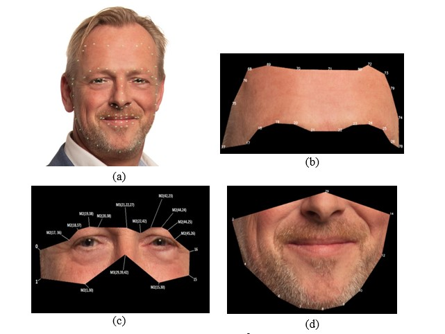

# Android-demo-app-Facial-Skin-Analysis

## Data preparation

1. Collected data.
* Self-collected dataset comprises frontal face images without makeup, clearly displaying various skin problems, collected from diverse sources such as the renowned [CelebAMask-HQ](https://github.com/switchablenorms/CelebAMask-HQ?tab=readme-ov-file) and [FFHQ](https://github.com/NVlabs/ffhq-dataset) datasets, as well as publicly available facial image repositories like Google, Istock, and Roboflow.
2. Generating Dataset use StyleGAN 3.
* We utilized the pre-trained StyleGAN3 model on the FFHQ dataset for initial training. We fine-tuned the model and generated a large set of high-quality images. After careful curation to ensure diversity and clarity, we compiled these into the Self-collected dataset.
3. Data Labeling for Facial Skin Diseases Classification
* To ensure a detailed assessment of facial wrinkles while minimizing interference from unrelated areas, we divided the face into three distinct regions using Dlib: the forehead, eyes, and mouth.

* Labeling Pigmentation, Wrinkles, and Pores into three severity levels: Good, Average, and Fair
4. Data Labeling for Facial Skin Diseases Segmentation
*  Labeling Wrinkles and Pores for segmentation using [CVAT](https://app.cvat.ai/)

## Model Selection for Mobile Deployment
1. Facial Skin Diseases Classification
* Mobilenet v2
2. Facial Skin Diseases Segmentation
* YOLOv8-seg

## Convert Model to Ncnn
* pt->onnx->ncnn

## Facial Skin Diseases Classification
1. IDE
* [Android Studio](https://androidstudio.googleblog.com/2023/11/android-studio-giraffe-202231-patch-4.html)
2. Framework
* [NCNN](https://github.com/Tencent/ncnn)
3. Language
* Java, Native C
4. Pipeline
* YOLOv5-face -> Dlib -> Mobilenet v2
5. Demo
  

https://github.com/Hieptm2002/Android-demo-app-Skin-Analysis/assets/91860427/87ef71bc-61c9-4e6b-beae-29c818430a4c

6. Difficulty
* There was a conflict between the Dlib and Ncnn libraries when building the application, but it has been fixed with the 
'-fno-exceptions' bug in the NCNN library's CMake file.
* There are differences between the image resizing methods of the PIL Python library and other resizing methods on Android (like the ncnn resize), which result in a 10% decrease in accuracy on the test set on Android compared to PC. Since the PIL Image library is not supported on Android, I wrote a new resize function in C++ that replicates the PIL resize function (Bilinear for RGB image), with cv::Mat as the input and output data type. The accuracy on the Android test set now difference between -1% and 1% compared to the PC.

## Facial Skin Diseases Segmentation 
1. IDE
* [Android Studio](https://androidstudio.googleblog.com/2023/11/android-studio-giraffe-202231-patch-4.html)
2. Framework
* [NCNN](https://github.com/Tencent/ncnn)
3. Language
* Java, Native C
4. Pipeline
* YOLOv5-face -> YOLOv8-seg
5. Demo

https://github.com/Hieptm2002/Android-demo-app-Skin-Analysis/assets/91860427/6a3f610c-2fca-40ae-866a-c426756eaf0e

6. Difficulty
There are difficulties in converting the model to ncnn and handling the output when there is only one output. [Solved](https://github.com/Digital2Slave/ncnn-android-yolov8-seg/wiki/Convert-yolov8%E2%80%90seg-to-ncnn-model-step-by-step)

## Result
1. Facial Skin Diseases Classification

|   Testset        | Model prediction accuracy on PC | Model prediction accuracy on Android |
| :--------------: | :-----------------------------: | :----------------------------------: |
| Pigmnetation     |             84.06%              |                 83.10%               |
| Pores            |             71.08%              |                 70.28%               |
| Forehead Wrinkle |             88.23%              |                 88.23%               |
| Eyes Wrinkle     |             87.84%              |                 87.45%               |
| Smile Wrinkle    |             89.00%              |                 88.60%               |  

> Pytorch=1.10.0+cu102
> 
> Android device: Xiaomi Redmi Note 8 Pro

2. Facial Skin Diseases Segmentation

> Future updates

## Note

1. Image from the Gallery
* Image with face straight, no makeup, no accessories (like glasses, etc.)
* Images larger than 1280x960 with faces occupying about 70~90% of the frame.
2. Image from the Camera
* Image with face straight, no makeup, no accessories (like glasses, etc.)
* Images with faces occupying about 70~90% of the frame.

## Reference

- CelebAMask-HQ : https://github.com/switchablenorms/CelebAMask-HQ

- FFHQ : https://github.com/NVlabs/ffhq-dataset

- Mobilenet v2 : https://pytorch.org/

- YOLOv5-face : https://github.com/deepcam-cn/yolov5-face

- Dlib : https://github.com/davisking

- YOLOv8-seg : https://github.com/ultralytics/ultralytics

- Ncnn Framework : https://github.com/Tencent/ncnn
